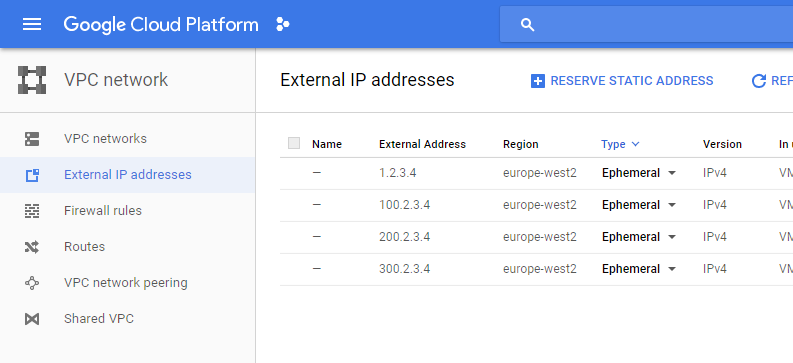

# GKE Cluster routing internet traffic through basic NAT

 - External services like hosted databases often have firewall rules which require a static IP address
 - This example routes all outbound Kubernetes traffic through a single NAT compute instance with a static IP 
 - Traffic heading for the kubernetes master is routed at a higher priority through the default internet gateway
 
## Quickstart

### Prerequisites 

1. Updated gcloud sdk 
2. A Project in Google Cloud in which you want to deploy this cluster 
3. Authenticated to google cloud

### Create

1. In `gke-with-nat-route.jinja` and `gke-with-nat-route.yml` replace any references to `europe-west2` and `europe-west2-a` with the desired zone/region
2. To give the deployment a unique name (so that multiple clusters can be configured using this approach), find and replace all on `devops` in `gke-with-nat-route.jinja`. `devops` is just the name I've used for my cluster.
3. Edit any cluster settings such as `machineType: g1-small` in `gke-with-nat-route.jinja` to the desired value
4. Run the following `gcloud` command - note that this takes a few minutes, and during that time the deployment can be monitored through the Google Cloud web UI:

```
gcloud deployment-manager deployments create devops-gke-with-nat --config gke-with-nat-route.yml
```

### Test external IP address

Run two `ubuntu` images in separate command windows. In the Google Cloud dashboard, check that these have been assigned to different nodes. If not, run `ubuntu3`, `ubuntu4` etc. until at least 2 are on separate nodes.

```
kubectl run -i --tty ubuntu1 --image=ubuntu --restart=Never -- sh
kubectl run -i --tty ubuntu2 --image=ubuntu --restart=Never -- sh
```

From each command window, check that the external IP address is the same:

```
apt-get update
apt-get install curl -y
curl ipinfo.io/ip
```

Back in the Google Cloud dashboard, check that the IP printed in the previous step matches that of the `nat-vm` instance (in this case `1.2.3.4`). Change the type of this address from Ephemeral to Static.



### Delete

Make sure to replace `devops` in the following commands before running:

```
gcloud compute routes delete devops-master-route -q                 
gcloud compute routes delete devops-cluster-route-through-nat -q
gcloud container clusters delete devops-cluster -q --zone europe-west2-a
gcloud compute instances delete devops-nat-vm -q --zone europe-west2-a
gcloud compute firewall-rules delete devops-nat-vm-firewall -q 
gcloud deployment-manager deployments delete devops-gke-with-nat -q        
```    

## How it works in a nutshell

1. Creates a network
2. Creates a subnet for the cluster 
3. Creates a subnet for the nat instance 
4. Creates a NAT compute instance 
5. Creates Firewall rules for NAT instance 
6. Creates the GKE cluster in the cluster's subnet created from step 2 with tag route-through-nat
7. Creates the route from the cluster to the master for instances with tag, route-through-nat
8. Creates the NAT route from the cluster to the NAT for all destinations at a lower priority than the master route above for instances with tag route-through-nat